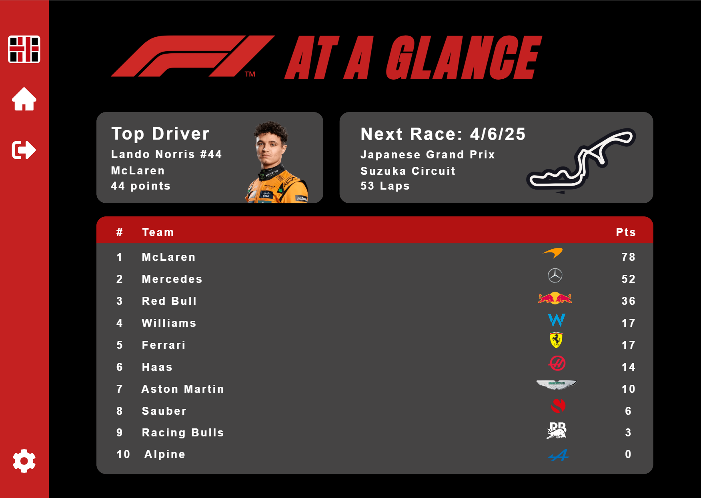

# Software-Engineering-Final

## Swiss Army App Summary

## Installation and Uses

## System Requirements
### For Developers:
* Windows: Windows 10 or later (64-bit recommended)
* Mac: macOS 10.13+ (High Sierra or later)
* Linux: Any modern distribution with OpenJDK or Oracle JDK support
* JDK 17+ (this project used JDK 23)
* JavaFX SDK (e.g., from Gluon) if you are using a JDK that does not include JavaFX
* Scene Builder from GluonHQ (supports JavaFX FXML editing)

## UML Diagrams

## Mockups

## User Stories
#### Landing Page
1. As a new user, I want to see a welcoming landing page so that I know what the app is and how to get started.
2. As a user, I want a clearly labeled "Get Started" button so that I can easily begin using the app.
3. As a returning user, I want a quick access option to continue where I left off so that I don't have to start over every time.

#### Settings Page
1. As a user, I want to toggle between light and dark mode so that I can view the app comfortably in different lighting conditions.
2. As a user, I want to control sound settings so that I can mute the app when I’m in a quiet environment.
3. As a user, I want to manage notification preferences so that I only receive alerts that are relevant to me.
