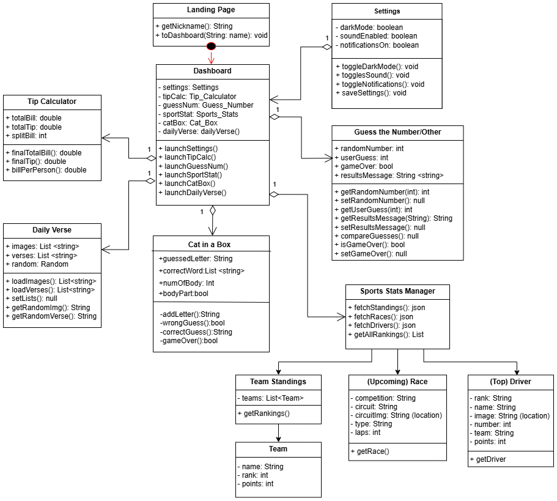
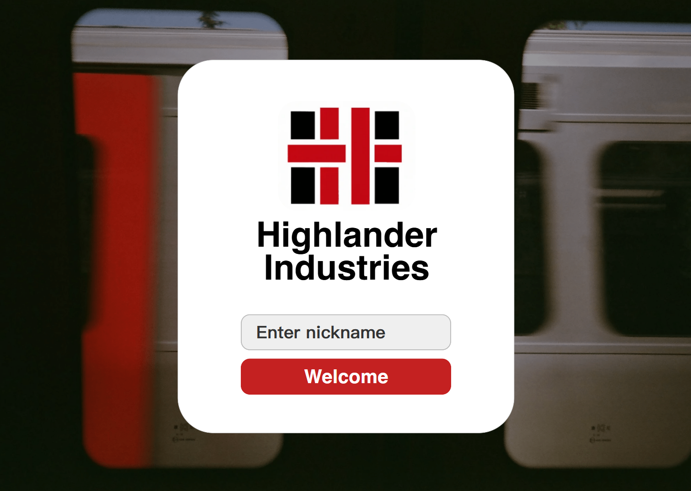
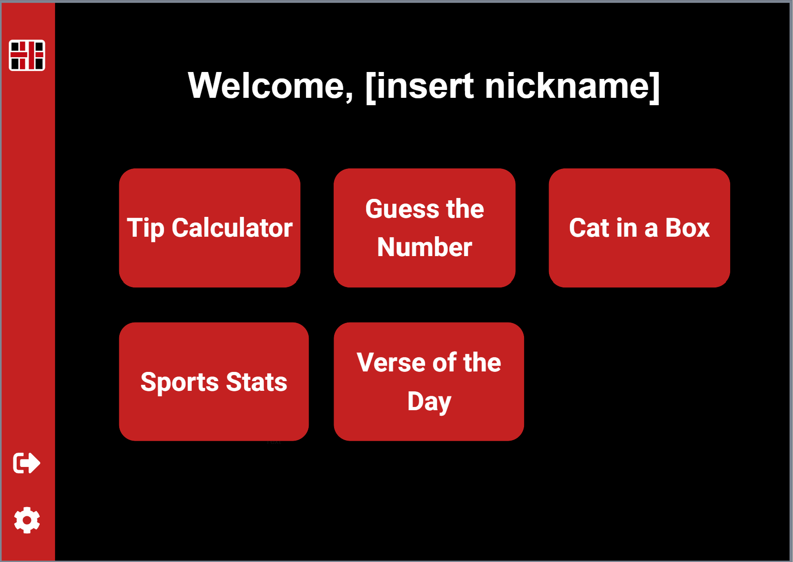
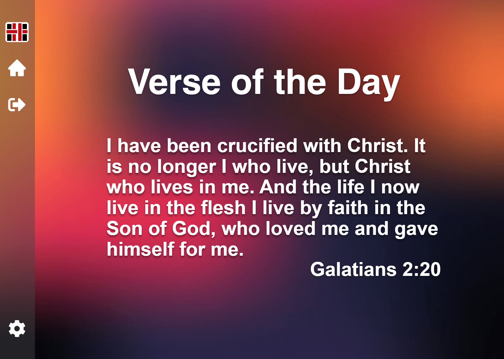
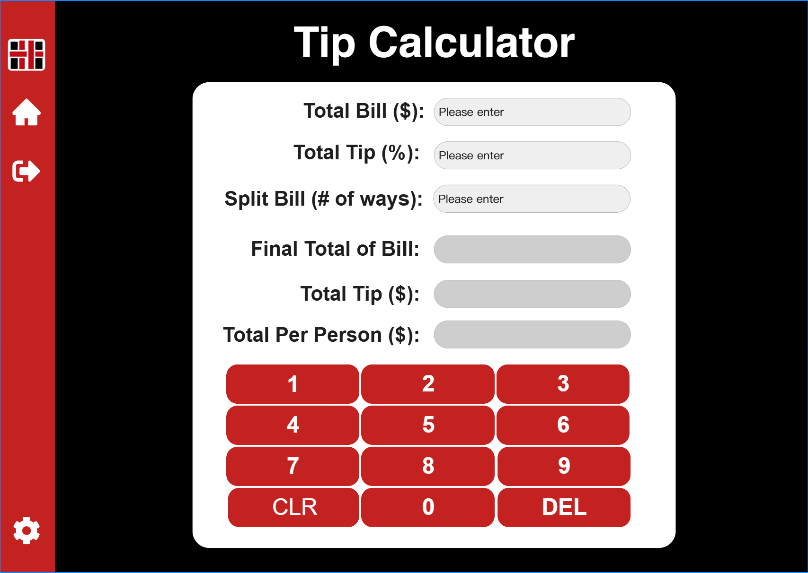
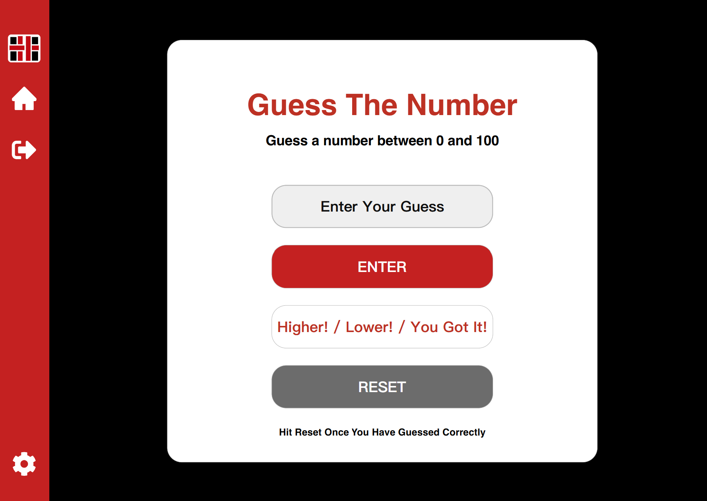
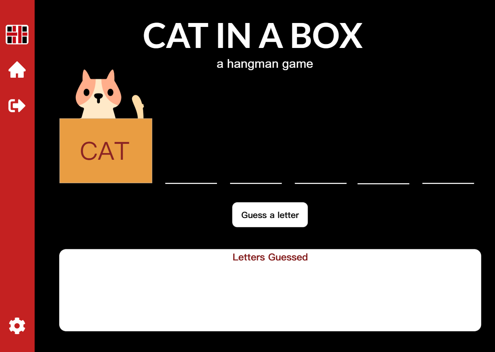
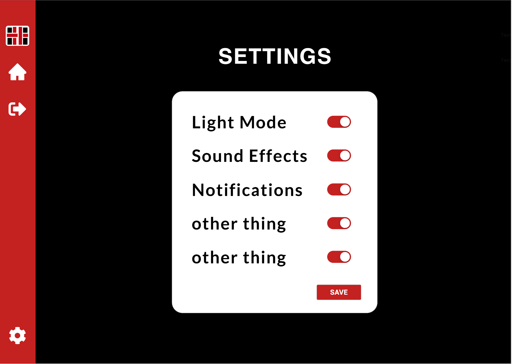

# Software-Engineering-Final
Team Members:
Ariana Overko, Jewel O'Bott, Joy Sulaiman, Tala Garibay

## Swiss Army App Summary
Tired of the same old boring waiting room magazines? Yeah, us too! Looking for something to pass the time while in our waiting room? Well, do we have the app for you!  We noticed that waiting rooms are getting more and more dull and sterile each year. There are less magazines and sometimes not great wifi. Enter our Swiss Army app where you have plenty of things to keep you busy. 
With each download the user gets a unique nickname, this can be as customized as you'd like. Whether you’d like to go by Brad or DigitalPhantom, you’ll be greeted with your name every time you open the app. 
Once the app is opened you'll have a variety of things to help the time pass quickly. 
The first one is a tip calculator, everyone struggles with figuring out what exactly to tip and with this activity you'll have one at the tip of your fingers. 
If you'd rather have your brain teased you can do our hangman or the Guess The Number game. Whichever one you pick it is guaranteed to work your brain and make you think. No more doom scrolling. 
What about sports? Don’t worry we have a section for sports stats. You’ll have the top stats from the newly popular F1 at the click of a button without having to direct away from the page.
For those who like to be reminded for the day by God’s word we have a section that tells a different verse each day. It will give the scripture and where to find it. Maybe it is the right verse for what you are facing that day!
Finally we have the setting portion, this allows you to change your nickname at any time. There are no limits for the amount of times you can change it! You can also change the color mode from dark to light and much more to make it your own. 

## Installation and Uses

## System Requirements
* Windows: Windows 10 or later (64-bit recommended)
* Mac: macOS 10.13+ (High Sierra or later)
* Linux: Any modern distribution with OpenJDK or Oracle JDK support
* JDK 17+ (this project used JDK 23)
* JavaFX SDK (e.g., from Gluon) if you are using a JDK that does not include JavaFX
* Scene Builder from GluonHQ (supports JavaFX FXML editing)

## User Stories
#### Landing Page
1. As a new user, I want to see a welcoming landing page so that I know what the app is and how to get started.
2. As a user, I want a clearly labeled "Get Started" button so that I can easily begin using the app.
3. As a returning user, I want a quick access option to continue where I left off so that I don't have to start over every time.

#### Settings Page
1. As a user, I want to toggle between light and dark mode so that I can view the app comfortably in different lighting conditions.
2. As a user, I want to control sound settings so that I can mute the app when I’m in a quiet environment.
3. As a user, I want to manage notification preferences so that I only receive alerts that are relevant to me.

#### Tip Calculator
1. As a user I want to see a section to input the bill, the tip in percentage, and how many ways the bill is split because I need to quickly and simply calculate each person's portion without doing the math myself. 
2. As a user I want to see a clear breakdown of the total bill into subtotal, tip amount (total) and price per person with tip added because I want to know exactly what I am paying.
3. As a user I want the interface to be simple and similar to that of a normal calculator because I want to calculate things quickly or when in a rush. 

#### Guess The Number Game
1. As a user I want the app to tell me if my guess was higher or lower than the randomized number because I want to know how close i am and change my guess next time accordingly.
2. As a user I want a clearly marked reset button because when I guess correctly I want to reset the game to find another random number. 
3. As a user I want the interface to be simple with a place to guess, an enter button, a place for a message to pop up and a reset button because I want to be able to play the game easily and without much thinking. 

## UML Diagrams

## Mockups

